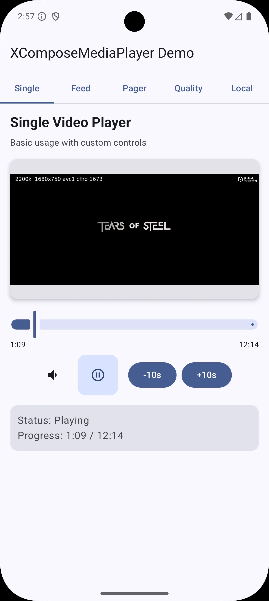
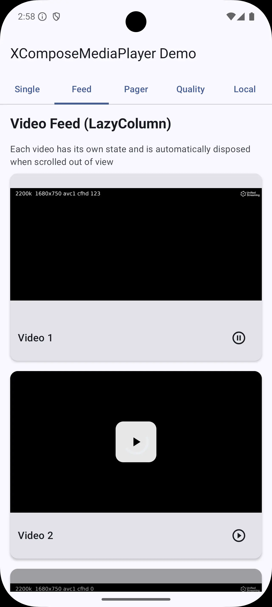
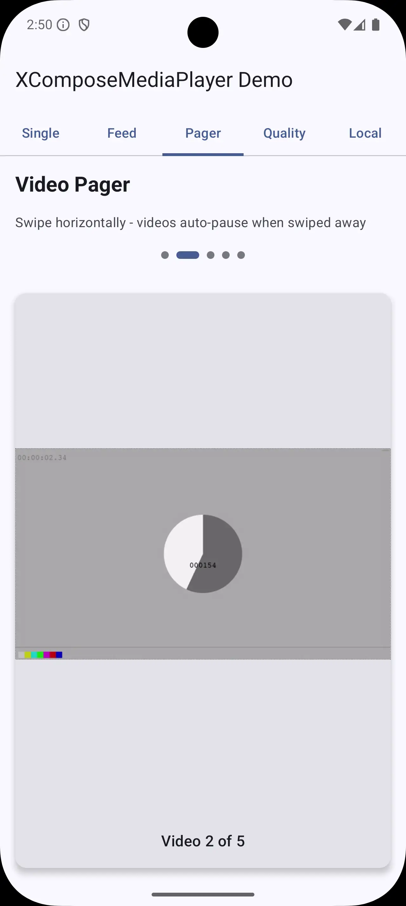
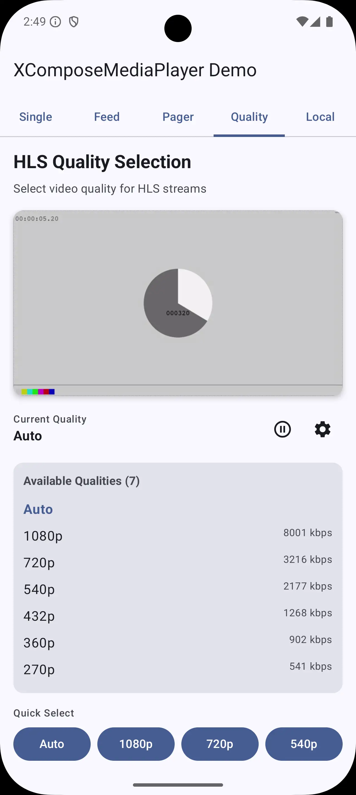
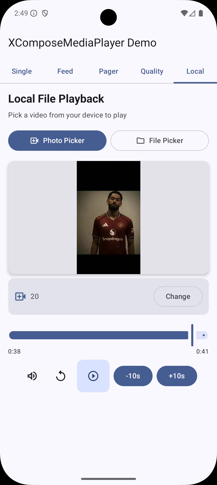

<p align="center">
  
</p>

<h1 align="center">XComposeMediaPlayer</h1>

<p align="center">
  <strong>A clean, simple, and powerful Jetpack Compose media player library for Android</strong>
</p>

<p align="center">
  Built on top of Media3/ExoPlayer with a simple state-based API
</p>

<p align="center">
  <a href="https://jitpack.io/#TuleSimon/XComposeMediaPlayer">
    
  </a>
  <a href="https://android-arsenal.com/api?level=21">
    
  </a>
  <a href="https://opensource.org/licenses/MIT">
    
  </a>
  <a href="https://github.com/TuleSimon/XComposeMediaPlayer">
    
  </a>
</p>

<p align="center">
  <a href="#-demo">Demo</a> •
  <a href="#-features">Features</a> •
  <a href="#-installation">Installation</a> •
  <a href="#-quick-start">Quick Start</a> •
  <a href="#-best-practices">Best Practices</a> •
  <a href="#-limitations">Limitations</a>
</p>

---

## 📱 Demo

<p align="center">
    
</p>


---

## 📸 Screenshots

<table>
  <tr>
    <td align="center">
      
      <br/>
      <strong>Single Player</strong>
      <br/>
      <em>Basic playback with controls</em>
    </td>
    <td align="center">
      
      <br/>
      <strong>Video Feed</strong>
      <br/>
      <em>LazyColumn with auto-dispose</em>
    </td>
    <td align="center">
      
      <br/>
      <strong>Video Pager</strong>
      <br/>
      <em>Swipeable with auto-pause</em>
    </td>
  </tr>
  <tr>
    <td align="center">
      
      <br/>
      <strong>HLS Quality</strong>
      <br/>
      <em>Adaptive quality selection</em>
    </td>
    <td align="center">
      
      <br/>
      <strong>Local Files</strong>
      <br/>
      <em>Pick and play device videos</em>
    </td>

  </tr>
</table>

---

## ✨ Features

| Feature | Description |
|---------|-------------|
| 🎯 **Simple API** | Just `rememberXMediaState()` and `XMediaPlayer` - that's it! |
| 📺 **Multiple Formats** | HLS (.m3u8), DASH (.mpd), MP4, WebM, and local files |
| 🎚️ **Quality Selection** | Built-in HLS/DASH quality picker with adaptive streaming |
| 💾 **Video Caching** | LRU disk cache with configurable size |
| ⚡ **Pre-caching** | Pre-load HLS streams for instant playback |
| 📊 **Smart Bandwidth** | Shared bandwidth meter across all players |
| ♻️ **Lifecycle Aware** | Auto-pause on background, auto-cleanup on dispose |
| 🔒 **Screen Wake Lock** | Keeps screen on during playback |
| 🎨 **Customizable** | Custom loading/error UI, controls, and overlays |
| 📱 **Compose Native** | Built specifically for Jetpack Compose |
| 🚫 **No DI Required** | Works without Hilt, Dagger, or Koin |

---

## ⚠️ Important: This is NOT a Replacement for ExoPlayer

**XComposeMediaPlayer is a wrapper library**, not a replacement for ExoPlayer/Media3. It provides:

- ✅ A simplified Compose-first API
- ✅ Automatic state management
- ✅ Common use case patterns (feeds, pagers, quality selection)
- ✅ Lifecycle handling out of the box

**For advanced use cases, you should still use ExoPlayer directly:**

- DRM content playback
- Advanced audio focus handling
- Background playback with `MediaSessionService`
- Custom track selection algorithms
- Full offline download management

You can access the underlying `ExoPlayer` instance via `state.player` when needed for advanced operations.

---

## 📦 Installation

Add JitPack repository to your `settings.gradle.kts`:

```kotlin
dependencyResolutionManagement {
    repositories {
        google()
        mavenCentral()
        maven { url = uri("https://jitpack.io") }
    }
}
```

Add the dependency to your module's `build.gradle.kts`:

```kotlin
dependencies {
    implementation("com.github.TuleSimon:XComposeMediaPlayer:1.0.0")
}
```

---

## 🚀 Quick Start

### Basic Usage

```kotlin
@Composable
fun VideoScreen() {
    val state = rememberXMediaState()

    XMediaPlayer(
        state = state,
        url = "https://example.com/video.m3u8",
        modifier = Modifier
            .fillMaxWidth()
            .aspectRatio(16f / 9f)
    )
}
```

### With Playback Controls

```kotlin
@Composable
fun VideoWithControls() {
    val state = rememberXMediaState()
    val isPlaying by state.isPlaying.collectAsState()
    val progress by state.progress.collectAsState()
    val duration by state.duration.collectAsState()

    Column {
        XMediaPlayer(
            state = state,
            url = "https://example.com/video.mp4",
            modifier = Modifier
                .fillMaxWidth()
                .aspectRatio(16f / 9f)
        )

        // Custom controls
        Row(horizontalArrangement = Arrangement.Center) {
            IconButton(onClick = { state.togglePlayPause() }) {
                Icon(
                    painter = painterResource(
                        if (isPlaying) R.drawable.ic_pause else R.drawable.ic_play
                    ),
                    contentDescription = null
                )
            }
        }

        // Progress bar
        Slider(
            value = if (duration > 0) progress.toFloat() / duration else 0f,
            onValueChange = { state.seekToPercent(it) }
        )
    }
}
```

### Video Feed (LazyColumn)

```kotlin
@Composable
fun VideoFeed(videos: List<String>) {
    LazyColumn {
        itemsIndexed(videos) { index, url ->
            // Each item gets its own state - auto-disposed when scrolled away
            val state = rememberXMediaState()

            XMediaPlayer(
                state = state,
                url = url,
                autoPlay = false, // Important: don't auto-play in lists!
                modifier = Modifier
                    .fillMaxWidth()
                    .aspectRatio(16f / 9f)
            )
        }
    }
}
```

### Video Pager (Auto-Pause)

```kotlin
@Composable
fun VideoPager(videos: List<String>) {
    val pagerState = rememberPagerState { videos.size }

    HorizontalPager(state = pagerState) { page ->
        val state = rememberXMediaState()
        val isCurrentPage = pagerState.currentPage == page

        // Auto play/pause based on visibility
        LaunchedEffect(isCurrentPage) {
            if (isCurrentPage) state.play() else state.pause()
        }

        XMediaPlayer(
            state = state,
            url = videos[page],
            autoPlay = false,
            modifier = Modifier.fillMaxSize()
        )
    }
}
```

### Local File Playback

```kotlin
@Composable
fun LocalVideoPlayer() {
    var videoUri by remember { mutableStateOf<Uri?>(null) }
    val state = rememberXMediaState()

    val picker = rememberLauncherForActivityResult(
        ActivityResultContracts.PickVisualMedia()
    ) { uri -> videoUri = uri }

    Column {
        Button(onClick = {
            picker.launch(PickVisualMediaRequest(VideoOnly))
        }) {
            Text("Pick Video")
        }

        videoUri?.let { uri ->
            XMediaPlayer(
                state = state,
                url = uri.toString(), // content:// URI works!
                modifier = Modifier
                    .fillMaxWidth()
                    .aspectRatio(16f / 9f)
            )
        }
    }
}
```

### HLS Quality Selection

```kotlin
@Composable
fun VideoWithQuality() {
    val state = rememberXMediaState(XMediaConfig.HighPerformance)
    val qualities by state.availableQualities.collectAsState()
    var showPicker by remember { mutableStateOf(false) }

    Column {
        XMediaPlayer(
            state = state,
            url = "https://example.com/stream.m3u8"
        )

        // Quality button (only shows for HLS/DASH)
        if (qualities.isNotEmpty()) {
            Button(onClick = { showPicker = true }) {
                Text("Quality: ${state.currentQuality.collectAsState().value?.label ?: "Auto"}")
            }
        }

        if (showPicker) {
            XMediaQualityPicker(
                state = state,
                onDismiss = { showPicker = false }
            )
        }
    }
}
```

---

## 📖 API Reference

### rememberXMediaState

```kotlin
@Composable
fun rememberXMediaState(
    config: XMediaConfig = XMediaConfig.Default
): XMediaState
```

### XMediaPlayer

| Parameter | Type | Default | Description |
|-----------|------|---------|-------------|
| `state` | `XMediaState` | - | State from `rememberXMediaState()` |
| `url` | `String` | - | Video URL or local URI |
| `modifier` | `Modifier` | `Modifier` | Layout modifier |
| `autoPlay` | `Boolean` | `true` | Start playing automatically |
| `repeat` | `Boolean` | `false` | Loop video |
| `startMuted` | `Boolean` | `false` | Start with audio muted |
| `showLoading` | `@Composable?` | `null` | Custom loading UI |
| `showError` | `@Composable?` | `null` | Custom error UI |
| `contentScale` | `ContentScale` | `Fit` | How to scale video |
| `surfaceType` | `XMediaSurfaceType` | `TextureView` | Surface type |
| `keepScreenOn` | `Boolean` | `true` | Prevent screen timeout |
| `onPlaybackEnded` | `(() -> Unit)?` | `null` | Playback end callback |
| `onError` | `((XMediaError) -> Unit)?` | `null` | Error callback |

### XMediaState Properties

| Property | Type | Description |
|----------|------|-------------|
| `isPlaying` | `StateFlow<Boolean>` | Whether video is playing |
| `isBuffering` | `StateFlow<Boolean>` | Whether video is buffering |
| `progress` | `StateFlow<Long>` | Current position in milliseconds |
| `duration` | `StateFlow<Long>` | Total duration in milliseconds |
| `availableQualities` | `StateFlow<List<XMediaQuality>>` | Available quality options |
| `currentQuality` | `StateFlow<XMediaQuality?>` | Currently selected quality |
| `error` | `StateFlow<XMediaError?>` | Current playback error |
| `isMuted` | `StateFlow<Boolean>` | Whether audio is muted |
| `player` | `ExoPlayer?` | Direct ExoPlayer access |

### XMediaState Methods

| Method | Description |
|--------|-------------|
| `play()` | Start/resume playback |
| `pause()` | Pause playback |
| `togglePlayPause()` | Toggle between play and pause |
| `seekTo(positionMs)` | Seek to position in milliseconds |
| `seekToPercent(percent)` | Seek to percentage (0.0 - 1.0) |
| `stop()` | Stop playback |
| `setQuality(quality)` | Set video quality |
| `setAutoQuality()` | Enable automatic quality selection |
| `mute()` | Mute audio |
| `unmute()` | Unmute audio |
| `setVolume(volume)` | Set volume (0.0 - 1.0) |
| `preCacheHls(url, ...)` | Pre-cache HLS stream for instant playback |
| `getCacheSize()` | Get current cache size in bytes |
| `clearCache()` | Clear all cached content |
| `getLastBandwidthEstimate()` | Get last measured bandwidth (bps) |
| `resetBandwidthEstimate()` | Reset bandwidth measurement |

### XMediaConfig

```kotlin
// Pre-configured options
XMediaConfig.Default         // Balanced settings
XMediaConfig.HighPerformance // Larger buffers, caching enabled, experimental bandwidth
XMediaConfig.LowLatency      // For live streams
XMediaConfig.DataSaver       // Limited resolution, caching enabled

// Custom configuration with all options
XMediaConfig(
    // Buffer settings
    minBufferMs = 5000,
    maxBufferMs = 60000,
    bufferForPlaybackMs = 2000,
    bufferForPlaybackAfterRebufferMs = 1000,

    // Caching (see CacheConfig below)
    cacheConfig = CacheConfig(
        enabled = true,
        maxCacheSize = 200L * 1024 * 1024 // 200 MB
    ),

    // Track selection (see TrackSelectorConfig below)
    trackSelectorConfig = TrackSelectorConfig(
        maxVideoWidth = 1920,
        maxVideoHeight = 1080,
        bandwidthFraction = 1.0f
    ),

    // Bandwidth estimation (see BandwidthConfig below)
    bandwidthConfig = BandwidthConfig(
        initialBitrateEstimate = 3_000_000L, // 3 Mbps
        useExperimentalBandwidthMeter = true
    ),

    // Audio
    handleAudioBecomingNoisy = true,
    preferredAudioLanguage = "en"
)
```

### CacheConfig

```kotlin
CacheConfig(
    enabled = true,                           // Enable disk caching
    maxCacheSize = 200L * 1024 * 1024,       // 200 MB LRU cache
    cacheDirectory = null,                    // Custom dir (null = app cache)
    cacheDirectoryName = "xmedia_cache"       // Subdirectory name
)
```

### TrackSelectorConfig

```kotlin
TrackSelectorConfig(
    // Quality timing
    minDurationForQualityIncreaseMs = 3000,   // Min playback before quality up
    maxDurationForQualityDecreaseMs = 20000,  // Max playback before quality down

    // Video constraints
    minVideoWidth = 0,                         // Min resolution
    minVideoHeight = 0,
    maxVideoWidth = Int.MAX_VALUE,             // Max resolution
    maxVideoHeight = Int.MAX_VALUE,
    maxVideoBitrate = Int.MAX_VALUE,           // Max bitrate in bps

    // Bandwidth usage
    bandwidthFraction = 1.0f,                  // 0.8 = conservative, 1.2 = aggressive

    // Adaptiveness
    allowMixedMimeTypeAdaptiveness = true,     // Allow codec switching
    allowNonSeamlessAdaptiveness = true,       // Allow brief freeze on switch

    // Force modes (for testing/data saving)
    forceLowestBitrate = false,
    forceHighestSupportedBitrate = false
)
```

### BandwidthConfig

```kotlin
BandwidthConfig(
    initialBitrateEstimate = 1_000_000L,      // Initial estimate (1 Mbps)
    useExperimentalBandwidthMeter = true,     // More accurate estimation
    resetOnNetworkChange = true                // Reset on WiFi <-> Cellular
)
```

---

## 🚀 Advanced Features

### Video Caching

Enable caching to store downloaded video segments on disk. Cached content loads instantly on replay.

```kotlin
// Enable caching with HighPerformance config (200MB cache)
val state = rememberXMediaState(XMediaConfig.HighPerformance)

// Or custom cache configuration
val state = rememberXMediaState(
    XMediaConfig(
        cacheConfig = CacheConfig(
            enabled = true,
            maxCacheSize = 500L * 1024 * 1024 // 500 MB
        )
    )
)

// Check cache usage
val cacheSize = state.getCacheSize()
Log.d("XMedia", "Cache: ${cacheSize / 1024 / 1024} MB")

// Clear cache when needed
state.clearCache()
```

### Pre-caching HLS Streams

Pre-load the next video while the current one plays for instant switching.

```kotlin
@Composable
fun VideoPlayer(currentUrl: String, nextUrl: String) {
    val context = LocalContext.current
    val state = rememberXMediaState(XMediaConfig.HighPerformance)

    // Pre-cache the next video in the background
    LaunchedEffect(nextUrl) {
        state.preCacheHls(
            url = nextUrl,
            context = context,
            durationMs = 15_000L, // Pre-cache 15 seconds
            onProgress = { progress ->
                Log.d("XMedia", "Pre-cache: ${(progress * 100).toInt()}%")
            },
            onComplete = {
                Log.d("XMedia", "Next video ready!")
            }
        )
    }

    XMediaPlayer(state = state, url = currentUrl)
}
```

**Static pre-caching** (without a player instance):

```kotlin
// In ViewModel or Application class
val cacheConfig = CacheConfig(enabled = true, maxCacheSize = 200L * 1024 * 1024)

XMediaState.preCacheHls(
    url = "https://example.com/next-video.m3u8",
    context = applicationContext,
    cacheConfig = cacheConfig,
    durationMs = 10_000L
)
```

### Bandwidth Monitoring

The library uses a **shared bandwidth meter** across all players for consistent quality selection.

```kotlin
val state = rememberXMediaState()

// Get current network speed
val bandwidthBps = state.getLastBandwidthEstimate()
val bandwidthMbps = bandwidthBps / 1_000_000.0

Text("Network: %.1f Mbps".format(bandwidthMbps))

// Reset if needed (next player starts fresh)
state.resetBandwidthEstimate()
```

### Track Selector Configuration

Fine-tune adaptive quality selection for your use case.

```kotlin
// Data saver: limit to 720p, 2 Mbps
val dataSaverConfig = XMediaConfig(
    trackSelectorConfig = TrackSelectorConfig(
        maxVideoWidth = 1280,
        maxVideoHeight = 720,
        maxVideoBitrate = 2_000_000,
        bandwidthFraction = 0.8f // Conservative bandwidth usage
    )
)

// High quality: prefer higher bitrates
val highQualityConfig = XMediaConfig(
    trackSelectorConfig = TrackSelectorConfig(
        minVideoHeight = 720,
        bandwidthFraction = 1.2f // Aggressive - use more bandwidth
    ),
    bandwidthConfig = BandwidthConfig(
        initialBitrateEstimate = 5_000_000L // Assume 5 Mbps initially
    )
)
```

---

## ✅ Best Practices

### 1. Always Set `autoPlay = false` in Lists

```kotlin
// ❌ Bad - all videos start playing at once
LazyColumn {
    items(videos) { url ->
        XMediaPlayer(state = state, url = url) // autoPlay defaults to true!
    }
}

// ✅ Good - videos only play when user interacts
LazyColumn {
    items(videos) { url ->
        XMediaPlayer(state = state, url = url, autoPlay = false)
    }
}
```

### 2. Use Proper Aspect Ratios

```kotlin
// ❌ Bad - video might get stretched or cropped unexpectedly
XMediaPlayer(
    state = state,
    url = url,
    modifier = Modifier.fillMaxSize()
)

// ✅ Good - maintains proper aspect ratio
XMediaPlayer(
    state = state,
    url = url,
    modifier = Modifier
        .fillMaxWidth()
        .aspectRatio(16f / 9f)
)
```

### 3. Use `HighPerformance` Config for Streaming

```kotlin
// ✅ Better buffering and caching for HLS/DASH
val state = rememberXMediaState(XMediaConfig.HighPerformance)
```

### 4. Use `LowLatency` Config for Live Streams

```kotlin
// ✅ Reduced latency for live content
val state = rememberXMediaState(XMediaConfig.LowLatency)
```

### 5. Enable Caching for Better UX

```kotlin
// ✅ Cached content loads instantly on replay/seek
val state = rememberXMediaState(XMediaConfig.HighPerformance)

// Or enable caching on default config
val state = rememberXMediaState(
    XMediaConfig(
        cacheConfig = CacheConfig(enabled = true)
    )
)
```

### 6. Handle Pager Visibility Properly

```kotlin
// ✅ Only play the current page
LaunchedEffect(pagerState.currentPage == page) {
    if (pagerState.currentPage == page) {
        state.play()
    } else {
        state.pause()
    }
}
```

### 7. Access ExoPlayer for Advanced Operations

```kotlin
// ✅ When you need advanced ExoPlayer features
val state = rememberXMediaState()

// Access underlying player
state.player?.let { exoPlayer ->
    // Do advanced stuff
    exoPlayer.setPlaybackSpeed(1.5f)
}
```

---

## 🚧 Limitations

### What XComposeMediaPlayer Does NOT Support

| Feature | Reason | Alternative |
|---------|--------|-------------|
| **Background Playback** | Requires `MediaSessionService` | Use Media3 directly with a service |
| **DRM Content** | Complex setup needed | Configure ExoPlayer's DRM system directly |
| **Picture-in-Picture** | OS-level feature | Implement PiP with Activity callbacks |
| **Chromecast** | Requires Cast SDK integration | Use Google Cast SDK |
| **Full Offline Download** | Only pre-caching supported | Use Media3's `DownloadService` for full downloads |
| **Multiple Audio Tracks** | Not exposed in API | Access via `state.player` |
| **Subtitles/Captions** | Not exposed in API | Access via `state.player` |
| **Ads (IMA)** | Requires IMA SDK | Use ExoPlayer's IMA extension |

> **Note:** Pre-caching IS supported! Use `state.preCacheHls()` to pre-load HLS content for instant playback.

### Known Issues

1. **First frame delay** - There may be a brief black frame before video renders
2. **Quality switching** - Brief pause during quality changes on some streams
3. **Live stream seeking** - Limited seek window on live HLS streams

---

## 🧪 Sample Streams for Testing

```kotlin
object SampleStreams {
    // VOD Streams
    const val TEARS_OF_STEEL =
        "https://demo.unified-streaming.com/k8s/features/stable/video/tears-of-steel/tears-of-steel.ism/.m3u8"

    const val APPLE_FMP4 =
        "https://devstreaming-cdn.apple.com/videos/streaming/examples/img_bipbop_adv_example_fmp4/master.m3u8"

    // Live Streams
    const val LIVE_AKAMAI =
        "https://cph-p2p-msl.akamaized.net/hls/live/2000341/test/master.m3u8"
}
```

---

## 📋 Requirements

| Requirement | Version |
|-------------|---------|
| Android SDK | API 21+ (Lollipop) |
| Kotlin | 1.9+ |
| Jetpack Compose | 1.5+ |
| Media3/ExoPlayer | 1.0+ |

---

## 📄 License

```
MIT License

Copyright (c) 2026 Tule Simon

Permission is hereby granted, free of charge, to any person obtaining a copy
of this software and associated documentation files (the "Software"), to deal
in the Software without restriction, including without limitation the rights
to use, copy, modify, merge, publish, distribute, sublicense, and/or sell
copies of the Software, and to permit persons to whom the Software is
furnished to do so, subject to the following conditions:

The above copyright notice and this permission notice shall be included in all
copies or substantial portions of the Software.

THE SOFTWARE IS PROVIDED "AS IS", WITHOUT WARRANTY OF ANY KIND, EXPRESS OR
IMPLIED, INCLUDING BUT NOT LIMITED TO THE WARRANTIES OF MERCHANTABILITY,
FITNESS FOR A PARTICULAR PURPOSE AND NONINFRINGEMENT. IN NO EVENT SHALL THE
AUTHORS OR COPYRIGHT HOLDERS BE LIABLE FOR ANY CLAIM, DAMAGES OR OTHER
LIABILITY, WHETHER IN AN ACTION OF CONTRACT, TORT OR OTHERWISE, ARISING FROM,
OUT OF OR IN CONNECTION WITH THE SOFTWARE OR THE USE OR OTHER DEALINGS IN THE
SOFTWARE.
```

---

## 👨‍💻 Author

<p align="center">
  
</p>

<p align="center">
  <strong>Tule Simon</strong>
  <br/>
  <a href="https://github.com/TuleSimon">GitHub</a> •
  <a href="https://twitter.com/AdesanyaSimon">Twitter</a>
</p>

---

## 🤝 Contributing

Contributions are welcome! Please feel free to submit a Pull Request.

1. Fork the repository
2. Create your feature branch (`git checkout -b feature/amazing-feature`)
3. Commit your changes (`git commit -m 'Add amazing feature'`)
4. Push to the branch (`git push origin feature/amazing-feature`)
5. Open a Pull Request

---

## ⭐ Star History

If you find this library useful, please consider giving it a star!

<p align="center">
  <a href="https://github.com/TuleSimon/XComposeMediaPlayer/stargazers">
    
  </a>
</p>

---

<p align="center">
  Made with ❤️ by <a href="https://github.com/TuleSimon">Tule Simon</a>
</p>
